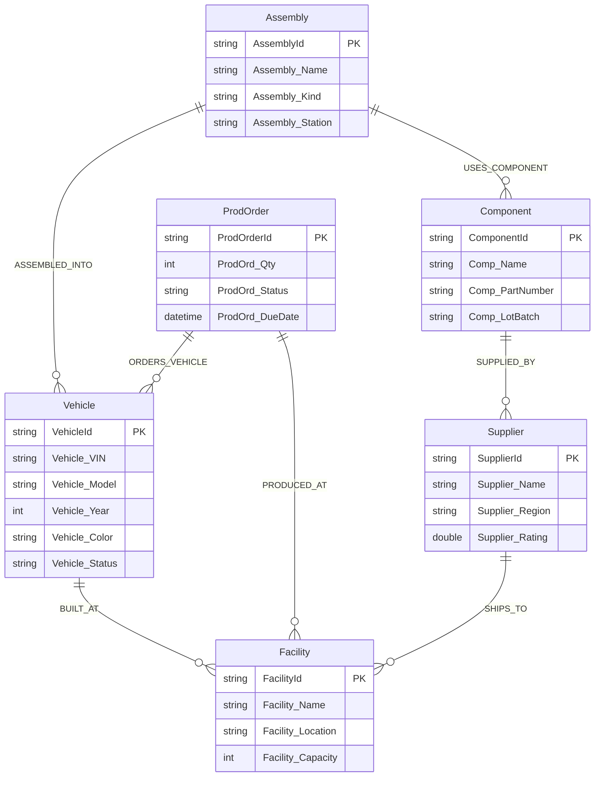

# Car Manufacturing Ontology Structure

## Company: Apex Motors
**Domain**: Automotive Manufacturing & Supply Chain  
**Use Case**: Production traceability — tracking vehicle assembly, component sourcing, and quality

---

## Entity Types

| Entity | Key | Key Type | Properties | Binding Source |
|--------|-----|----------|------------|----------------|
| **Vehicle** | VehicleId | string | VehicleId, Vehicle_VIN, Vehicle_Model, Vehicle_Year, Vehicle_Color, Vehicle_Status | Lakehouse (DimVehicle) |
| **Assembly** | AssemblyId | string | AssemblyId, Assembly_Name, Assembly_Kind, Assembly_Station | Lakehouse (DimAssembly) + Eventhouse (AssemblyTelemetry) |
| **Component** | ComponentId | string | ComponentId, Comp_Name, Comp_PartNumber, Comp_LotBatch | Lakehouse (DimComponent) |
| **Facility** | FacilityId | string | FacilityId, Facility_Name, Facility_Location, Facility_Capacity | Lakehouse (DimFacility) + Eventhouse (FacilityTelemetry) |
| **Supplier** | SupplierId | string | SupplierId, Supplier_Name, Supplier_Region, Supplier_Rating | Lakehouse (DimSupplier) |
| **ProdOrder** | ProdOrderId | string | ProdOrderId, ProdOrd_Qty, ProdOrd_Status, ProdOrd_DueDate | Lakehouse (DimProdOrder) |

### Timeseries Properties

| Entity | Property | Type | Source Table |
|--------|----------|------|-------------|
| Assembly | Asm_Torque | double | AssemblyTelemetry |
| Assembly | Asm_TempC | double | AssemblyTelemetry |
| Assembly | Asm_CycleTime | double | AssemblyTelemetry |
| Facility | Fac_EnergyKWh | double | FacilityTelemetry |
| Facility | Fac_Throughput | double | FacilityTelemetry |
| Facility | Fac_DowntimeMin | double | FacilityTelemetry |

---

## Relationship Types

| Relationship | Source → Target | Edge Table | Description |
|-------------|----------------|------------|-------------|
| **BUILT_AT** | Vehicle → Facility | EdgeVehicleFacility | Vehicle was manufactured at facility |
| **ASSEMBLED_INTO** | Assembly → Vehicle | EdgeAssemblyVehicle | Assembly installed into vehicle |
| **USES_COMPONENT** | Assembly → Component | EdgeAssemblyComponent | Assembly uses this component |
| **SUPPLIED_BY** | Component → Supplier | EdgeComponentSupplier | Component sourced from supplier |
| **PRODUCED_AT** | ProdOrder → Facility | EdgeOrderFacility | Production order assigned to facility |
| **ORDERS_VEHICLE** | ProdOrder → Vehicle | EdgeOrderVehicle | Production order produces vehicle |
| **SHIPS_TO** | Supplier → Facility | EdgeSupplierFacility | Supplier ships parts to facility |

---

## ER Diagram (Mermaid)



---

## Multi-Hop Traversal Examples

### 1. Component Traceability (3 hops)
**Question**: Which suppliers provided components in vehicle VH-001?

```
Vehicle ←[ASSEMBLED_INTO]← Assembly -[USES_COMPONENT]→ Component -[SUPPLIED_BY]→ Supplier
```

### 2. Supplier Impact Analysis (3 hops)
**Question**: Which vehicles contain parts from supplier SUP-003?

```
Supplier ←[SUPPLIED_BY]← Component ←[USES_COMPONENT]← Assembly -[ASSEMBLED_INTO]→ Vehicle
```

### 3. Production Order Tracking (2 hops)
**Question**: What facility and vehicle are tied to production order PO-005?

```
ProdOrder -[ORDERS_VEHICLE]→ Vehicle -[BUILT_AT]→ Facility
```
